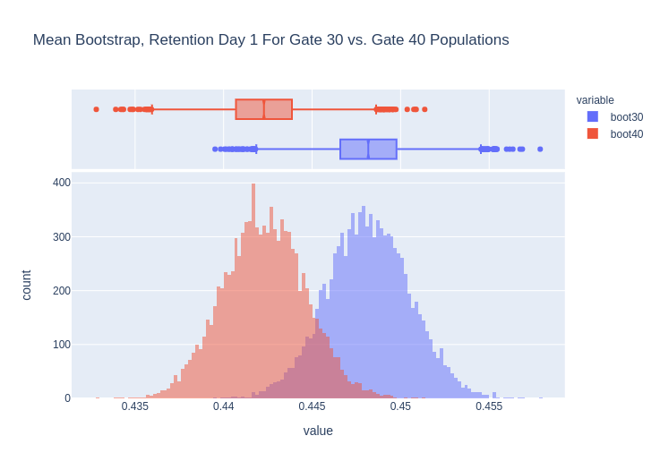
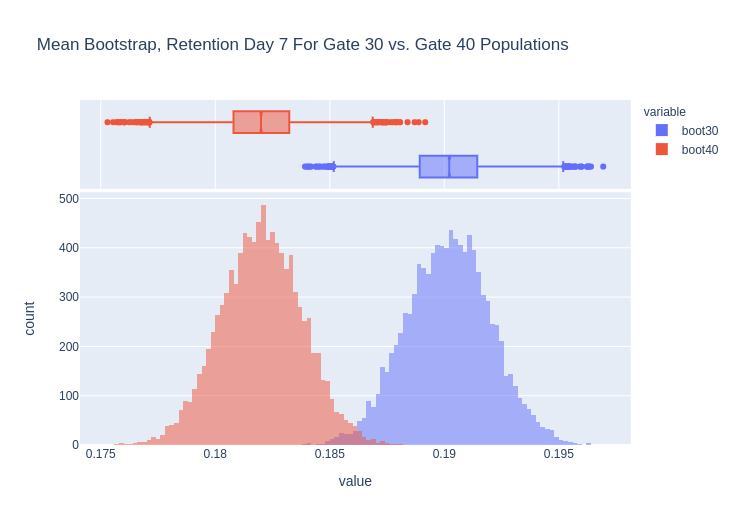
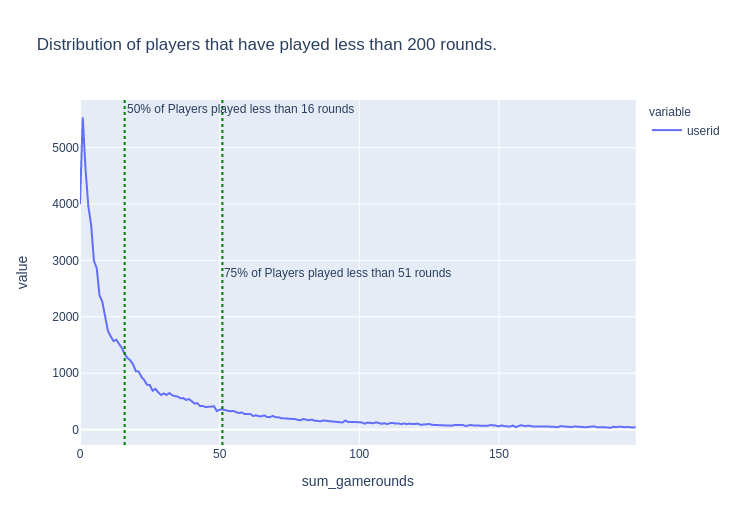

# Interpretation of A/B test - Cookie Cats Dataset
## Repo structure
|File|Description|
|---|---|
| [Analysis](<./A_B Testing Results Interpretation.ipynb>) | Jupyter notebook containing the analysis. From the EDA to the bootstrap analysis of the A/B test results|
| [Data Folder](<./data>) | Folder containing the `.zip` file downloaded from Kaggle, the unzipped `.csv` file, and the images used in this `README.md`|

## Insights
Following a bootstrap analysis, we found out that putting the gate at level 30 increases player retention on day +1 (with a 96.25% probability of increase), but especially on day +7 (99.94% probability of increase).

Prior to this analysis, we did a Welch's T-test, and found out that the populations could not be differentiated when looking at the day +1 retention (p-value of 0.0739). However, the p-value was far lower for the day +7 retention (0.0016), indicating a significant difference between the populations.

This makes sense as we can imagine few players would have reached level 30 after one day (especially when most of the players only play up to level 16 at best). See below for a visual confirmation of the populations:

## Details
### The data
The dataset is relatively simple. It lists two groups of players, the amount of rounds they played as well as the player retention after one day following the installation and after 7 days.

These two groups of players differ because the first group was able to unlock a gate at level 30, whilst the other had to reach level 40 to unlock the same gate.

These two groups are of similar sizes: 45489 players had the gate at level 40 vs. 44700 with the gate at level 30 (50.4%/49.6%). One outlier was observed in the gate_30 population and was removed before the analysis took place.

### EDA
During the EDA, we found out that about 55.5% of the players did not play within the first 24 hours whilst only 18.6% of the players remained after 7 days, regardless of which group they are part of (see table below for group breakdown). It is also worth noting 4.4% of people who installed the game never played it.

| Population | Retention 1 |Retention 7 |
|---|:---:|:---:|
| Global | 44.5% | 18.6% |
| Gate 30 | 44.8% | 19.0% |
| Gate 40 | 44.2% | 18.2% |

The short term aspect of the game is reinforced when we look at the rounds played: 50% of the players played less than 16 rounds, whilst 75% played less than 51 rounds.

It is therefore quite important to make an impact early in the game!

### T-Test
Note that the variance of the populations (in the table below) is very similar an a standard t-test would probably yield similar results.

| Population | Retention 1 | Retention 7 |
|---|:---:|:---:|
| Gate 30 | 0.247322 | 0.154017 |
| Gate 40 | 0.246674 | 0.148879 |